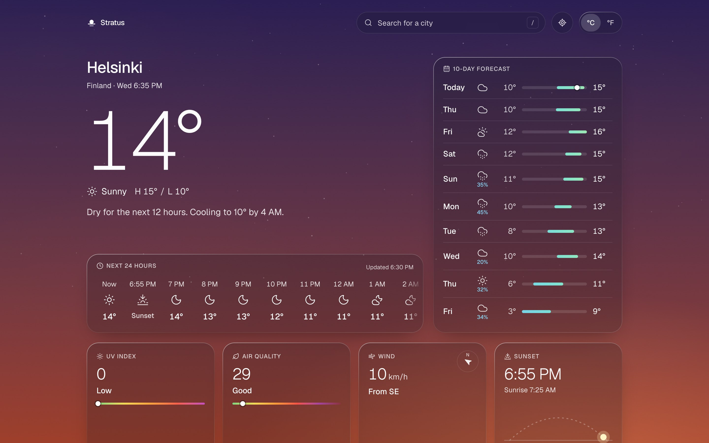
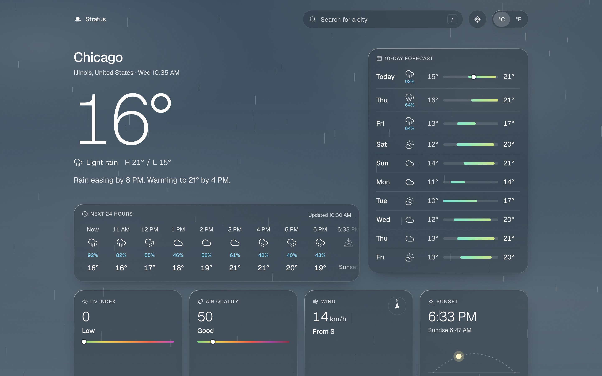
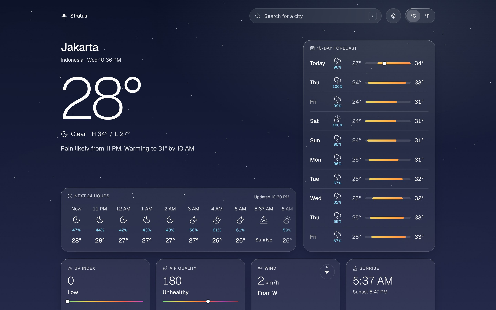
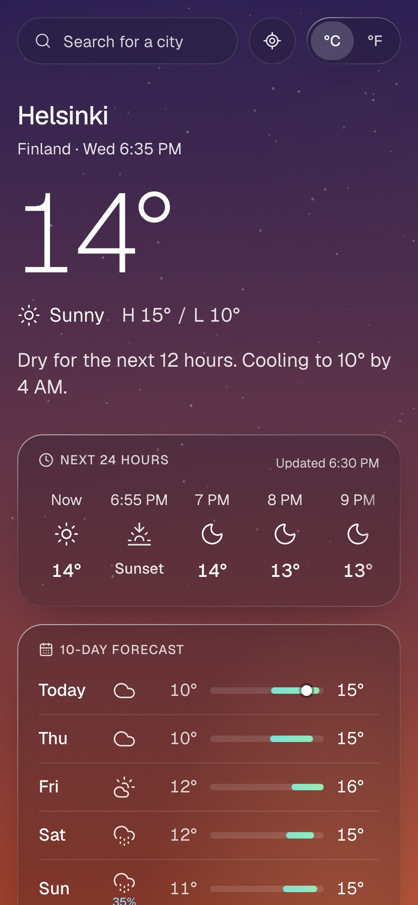
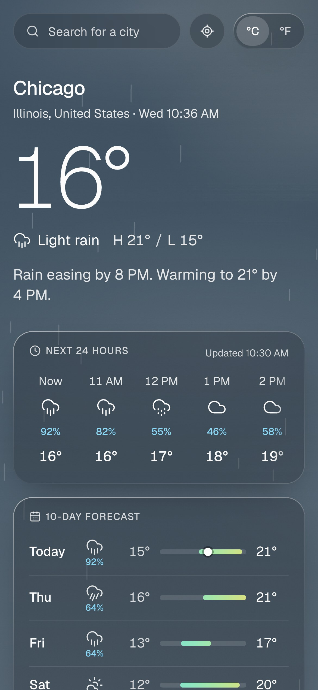
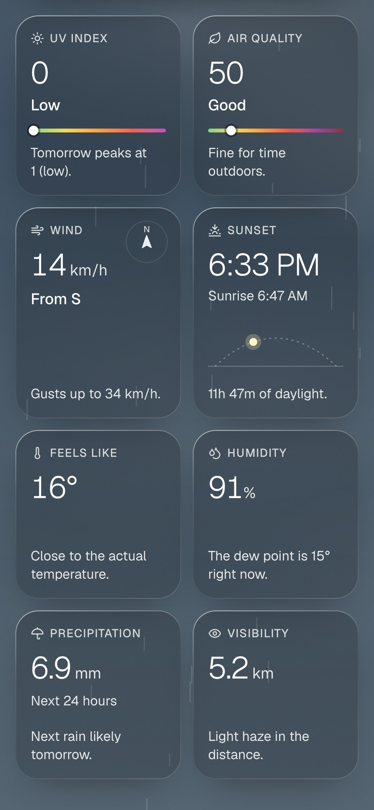

# Stratus

A weather app for any city: current conditions, the next 24 hours, the next 10 days, UV and air quality. The background is drawn from the forecast itself, so dusk in Helsinki and a wet morning in Chicago look like what they are.

Built with Next.js 16, React 19, TypeScript and Tailwind CSS 4. Weather data comes from [Open-Meteo](https://open-meteo.com), which needs no API key, so the project runs after `npm install` with nothing to configure.

**Live: [stratus-weather.vercel.app](https://stratus-weather.vercel.app)**



| Rain, daytime                                                                 | Clear, night                                                               |
| ----------------------------------------------------------------------------- | -------------------------------------------------------------------------- |
|  |  |

<p>
  
  
  
</p>

## What it does

- **Search any city.** Suggestions appear as you type and are ranked by population, so "jakar" lists Jakarta before the town of Jakar in Bhutan. It works from the keyboard: `/` or `⌘K` focuses the field, arrows move, Enter picks, Esc closes. Recent places show when the field is empty.
- **Use my location.** One button. Coordinates are rounded to two decimals, about 1 km, before they leave the browser.
- **Opens somewhere useful.** On the deployed site, a first visit shows the city your IP address resolves to, with no permission prompt. After that it opens on the last place you looked at.
- **Reads the forecast for you.** One or two sentences under the temperature, such as "Rain likely from 10 AM. Warming to 21° by 4 PM." They are generated by rules from the next 12 hours of data, and answer the umbrella question before you read a number.
- **Next 24 hours**, with rain chances of 20% and above, and sunrise and sunset placed where they fall.
- **10-day forecast** with range bars on one shared scale, colored by absolute temperature, so the shape of the week reads at a glance.
- **Details that come with advice.** UV index and until when to use sun protection, US AQI and what the level means, wind with direction and gusts, feels-like with the reason, humidity with dew point, rain expected in the next 24 hours and the next wet day, visibility, and sunrise or sunset with the sun's position.
- **°C and °F.** Switching is instant and does not refetch anything. The choice is remembered, and first-time visitors from the US get °F.
- **Local time.** Every time on screen is in the searched city's time zone. Checking Tokyo from Jakarta shows Tokyo's 3 PM.
- **Link previews.** A shared link unfurls into an image of the place, its temperature and its current sky ([example](docs/screenshots/og-preview.png)), rendered on request and cached for 10 minutes.
- **Shareable links.** The place lives in the URL (`/?lat=35.69&lon=139.69&name=Tokyo`), so a forecast can be bookmarked, refreshed or sent to someone.

## The sky

It is the one expressive part of an otherwise quiet interface. For every forecast the server derives a scene: a gradient for the sun's phase (night, dawn, day or dusk, from that day's sunrise and sunset), greyed by cloud cover, with stars on clear nights, drifting clouds, haze in fog, and rain or snow drawn on a canvas at the angle of the actual wind.

The scene is a set of CSS custom properties registered with `@property`, so choosing another city animates the sky from one state to the next. It is rendered on the server, so the first paint already has the right sky. The canvas pauses when the tab is hidden and never starts when the system asks for reduced motion. There are no lightning flashes, for people who are sensitive to flashing light.

The panels are clear glass: a light tint and a strong blur, so the sky's color comes through, with a rim of light along the edge. By day the tint is a faint smoke; at night it turns to frost, the way the cards in Apple's Weather app gain body after dark.

Clear glass makes contrast a real risk, so readability has a test. It checks 32 combinations of weather and time of day, with the brightest part of a cloud, haze or the sun's glow behind the text, and fails the build if secondary text drops below WCAG AA (4.5:1) on the sky or on a panel. The lowest value it measures today is 4.65:1.

## Decisions

**The server fetches; the client handles interaction.** The forecast is requested in a Server Component and cached for 10 minutes, since Open-Meteo updates current conditions every 15. The page arrives rendered. Client-side JavaScript covers the search box, the unit switch, the location button and the precipitation canvas.

**Data stays metric, and units belong to presentation.** Temperatures, speeds and distances render through small client components inside server-rendered markup, so the °C/°F switch rewrites a few text nodes with no request. The preference is stored in a cookie and read on the server, so there is never a flash of °C before °F.

**Changing city keeps the old forecast on screen.** Navigation runs inside a React transition: while the next forecast loads, the current one dims instead of being swapped for a skeleton during a 200 ms request. The skeleton only appears on a cold load.

**External data is validated at the edge of the app.** Every Open-Meteo response is parsed with zod and mapped to a typed domain model. Components never see the provider's field names, so a change on their side breaks one mapper, not twenty components.

**Failures stay local.** Air quality comes from a separate endpoint and becomes "no data" if it fails, while the forecast still renders. If the forecast itself fails, a retry appears in the page and search keeps working. Next's `catchError` only resets when the pathname changes, and places differ by query string, so this boundary resets when the place changes.

**Accessibility is built in.** The search box follows the WAI-ARIA combobox pattern and announces result counts. The unit switch is a pair of native radio buttons. Icons are decorative, with conditions and rain chances written out for screen readers. There is a skip link, a visible focus ring, and a reduced-motion path for every animation.

## Left out on purpose

- **Radar and maps.** They need a tile provider, usually an API key, and would outweigh the rest of the app. The brief asked for current weather and a forecast.
- **Severe weather alerts.** Open-Meteo has no global alert feed, and national feeds differ by country.
- **Accounts and saved lists.** Recent places cover going back to a city without signing in.

## What I would do next

- Saved places that can be reordered, kept in the URL or an account.
- 15-minute precipitation for the next two hours ("rain starting in 12 minutes"), which Open-Meteo provides for some regions.
- Playwright tests for the search and location flows, and visual snapshots of each sky.
- Translated copy. The clock format already follows the viewer's locale.

## Running it

Requires Node.js 20.9 or later.

```bash
npm install
npm run dev
```

Then open http://localhost:3000. There is no IP location on localhost, so the first screen asks for a city.

| Script                 | What it runs        |
| ---------------------- | ------------------- |
| `npm test`             | Unit tests (Vitest) |
| `npm run lint`         | ESLint              |
| `npm run typecheck`    | TypeScript          |
| `npm run format:check` | Prettier            |
| `npm run build`        | Production build    |

GitHub Actions runs all five on every push.

## Project structure

```
src/
  app/                  The page, the /api/places route, the icon
  components/
    atmosphere/         Sky, clouds, stars, precipitation canvas
    forecast/           Current conditions, hourly, daily, details
    search/             City search and "use my location"
    units/              °C/°F context, toggle, unit-aware values
  lib/
    weather/            Domain types, Open-Meteo client and schemas,
                        summaries, units, WMO weather codes
    atmosphere/         Scene derivation and the contrast test
    place*.ts           Reading and writing the selected place
```

## Credits

Weather, air quality and geocoding by [Open-Meteo](https://open-meteo.com) (CC BY 4.0). Reverse geocoding by [BigDataCloud](https://www.bigdatacloud.com). Icons from [Lucide](https://lucide.dev). Typeface: [Geist](https://vercel.com/font).
